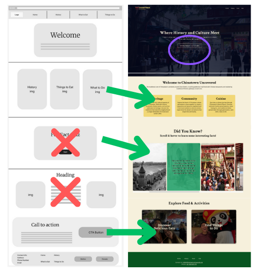
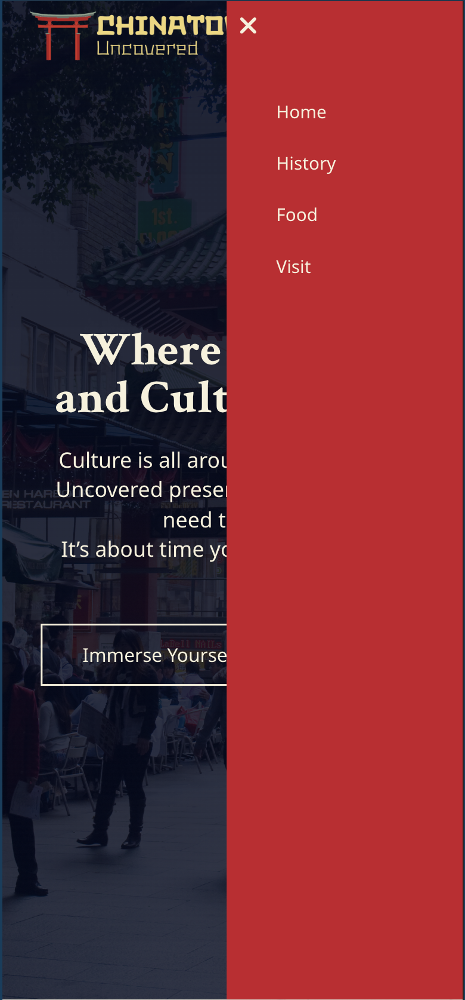
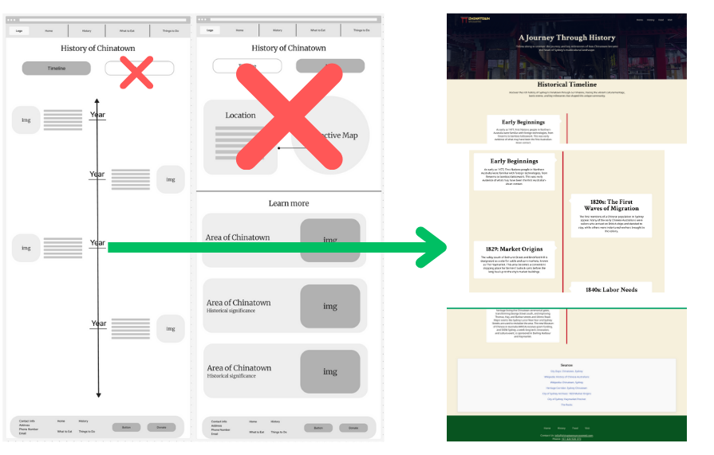
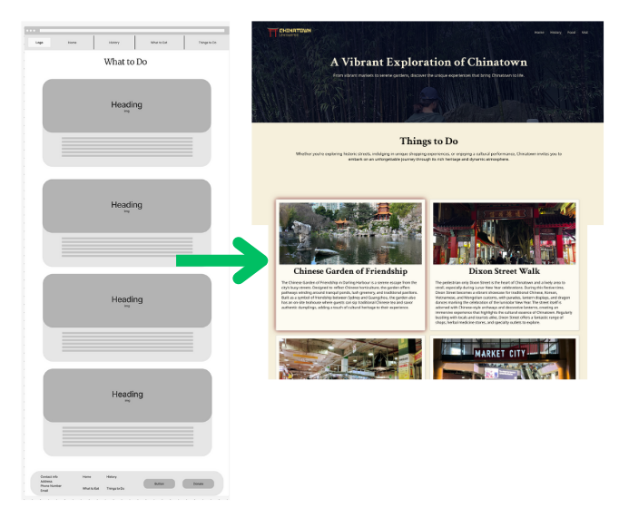

# Documentation
The purpose of Chinatown Uncovered is to offer a comprehensive experience of Chinatown in Haymarket, Sydney, blending historical insights, cultural stories, and local recommendations into a seamless guide. This site is designed for users who seek a deeper understanding and connection to Chinatown, making it a unique resource beyond typical tourist listings.

Several edits were made from the wireframe to the prototype, with the goal of finding the simplest methods to carry out the purpose of the website.

Colors and text fonts remain consistent with the moodboard, with traditional Chinese shades of red, green, blue, and gold playing large roles on this website.

*Responsive and accessible design were used throughout all pages.*

Verified to be working on Chrome, Safari, Opera, Firefox.

## [Home Page](http://127.0.0.1:3000/home.html)

### Header
----------
Changed to take up the entire viewport, with the navigation bar including the logo, which links to the home page, as well as links to each page of the website. Although the navigation bar is not fixed, the home page has three additional buttons that allow users to navigate the main pages throughout the homepage. On a smaller device, the navigation bar links turn into a hamburger menu, with the ability to open and close the menu.

The homepage opens with a visually engaging banner image of Chinatown, with a welcoming headline and brief introduction to capture attention and set the cultural tone of the website.A button that leads to the History page (circled in purple) is added in the hero to lead users straight to the timeline - with a primary focus on cultural experience. 

On the other pages, the header becomes half of the viewport, putting more focus on the content on the page.

*Future Improvement:*
Make the nav bar reactive to users' scrolling - so when they scroll down, the nav bar disappears but when they scroll up, the nav bar comes down.

### Cards
The informational cards under the hero have remained largely unchanged from the wireframe. The addition of a border shadow when hovering helps users focus on the content of the card they are reading.

### "Fun Facts"
I originally planned to create a quiz to test users' knowledge, but this would require more advanced CSS and JavaScript that I'm not familiar with. Keeping an emphasis on historical information, I pivoted to creating a carousel with images that reveal interesting facts when hovered. Scrolling within the carousel snaps the left-most card into place - a feature that was added to guide mobile users.

*Future Improvement:*
Make each fun fact card a button that links onto a historical event in the History page. 

### Call to Action: 
Two large buttons on the bottom lead users to the Food and Visit pages, with the buttons zooming in and getting a darker tint when hovered - to let users know that these are interactive.

### Footer:
Simple footer with links to all pages, along with contact information.

*Future Improvement:*
Adding more features to the footer, such as a "Subscribe to newsletter" or an embedded "Message Us" box.

### Acknowledgement
Includes a modal for an Acknowledgement of Country to recognize the Gadigal people as the Traditional Custodians of the land where Haymarket Chinatown is located. The goal was to respect the history and cultural significance of the land and reinforce cultural awareness, aligning with accessibility and community engagement goals of the website.

## [History Page](http://127.0.0.1:3000/history.html)

From the original design, the second "page" within the History page was removed due to the complexity of creating an interactive map as well as the redundancy in information that would present between the timeline and map page. As a result, information that was intended to focus on specific locations was implemented into timeline events. 

### Timeline
The timeline starts from the top (earlier) to bottom (present), as a way for users to travel chronologically through the evolution of Sydney's Chinatown. To add some spice and interactivity, the red timeline fades in from top to bottom, along with the event boxes. 

Because of the page's rather long nature, I implemented a scroll watcher that follows a user through the length of the page - this helps users know their location in the timeline relative to the page.

Lastly, sources that were used are provided so users can choose to explore externally.

## [Food Page](http://127.0.0.1:3000/food.html)

A subpage for drinks and filters for cuisine were not used in the prototype due to the complexity with JavaScript required. Instead, I opted for a carousel for four different cuisines that are largely prevalent in Chinatown (represented by the most populous ethnicities in Haymarket).

Large chains and mom-and-pop restaurants were considered in order to represent each cuisine to the best of my ability. The cards within the carousel contain links to the restaurants' respective Google pages, for users to read reviews, check the menu, and find directions - this is not the primary goal of Chinatown Uncovered, but can be implemented as a future improvement.

## [Visit Page](http://127.0.0.1:3000/visit.html)

The Visit page has remained the most consistent from wireframes, as the structure of it was largely based on section and container designs from earlier pages. Specific activities and places to see are highlighted on this page - not so much as a commercial sale but as an immersive cultural experience.

Similar to the informational cards on the Home page, the cards here have a dark red shadow when hovered on, letting users better focus on the contents. 

## References
Australian Bureau of Statistics. (2021). QuickStats 2021: Haymarket (SAL 11884). Retrieved from https://www.abs.gov.au/census/find-census-data/quickstats/2021/SAL11884

City Days. (n.d.). Chinatown Sydney. Retrieved from https://citydays.com/places/chinatown-sydney/

City of Parramatta. (n.d.). Mak Sai Ying aka John Shying. Retrieved from https://historyandheritage.cityofparramatta.nsw.gov.au/people/mak-sai-ying-aka-john-shying

City of Sydney. (n.d.). Haymarket Precinct. Retrieved from https://www.cityofsydney.nsw.gov.au/haymarket-precinct

City of Sydney Archives. (n.d.). In 1829 the valley south to the city’s market buildings. Retrieved from https://archives.cityofsydney.nsw.gov.au/nodes/view/1913301#:~:text=In%201829%20the%20valley%20south,to%20the%20city’s%20market%20buildings

Destination NSW. (n.d.). Chinatown and Haymarket. Retrieved from https://www.sydney.com/destinations/sydney/sydney-city/chinatown-and-haymarket

Heritage Corridor. (n.d.). Sydney Chinatown. Retrieved from https://www.heritagecorridor.org.au/heritage-connections/sydney-chinatown

Ovolo Hotels. (n.d.). Capitol Theatre Sydney. Retrieved from https://ovolohotels.com/sydney/capitol-theatre-sydney/

Sydney Expert. (n.d.). How to Celebrate Lunar New Year in Sydney. Retrieved from https://sydneyexpert.com/how-to-celebrate-lunar-new-year-in-sydney/

The Rocks. (n.d.). Asian Culture Contribution to The Rocks. Retrieved from https://www.therocks.com/editorials/asian-culture-contribution-to-the-rocks

Wikipedia. (2024). Chinatown, Sydney. In Wikipedia. Retrieved from https://en.wikipedia.org/wiki/Chinatown,_Sydney

Wikipedia. (2024). History of Chinese Australians. In Wikipedia. Retrieved from https://en.wikipedia.org/wiki/History_of_Chinese_Australians
